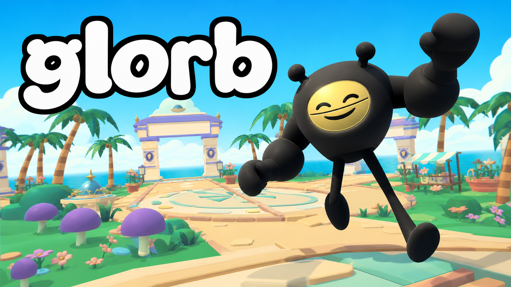
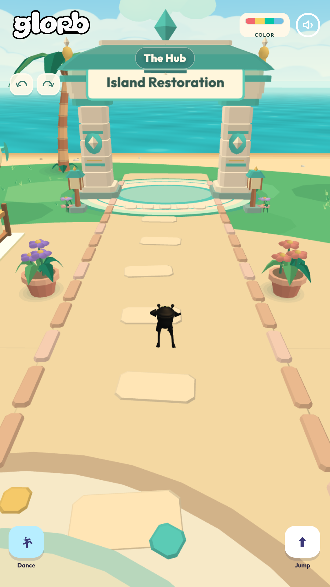
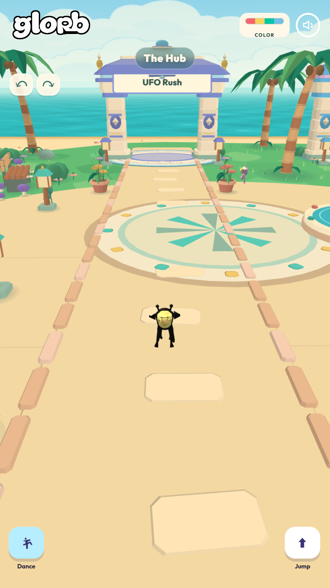
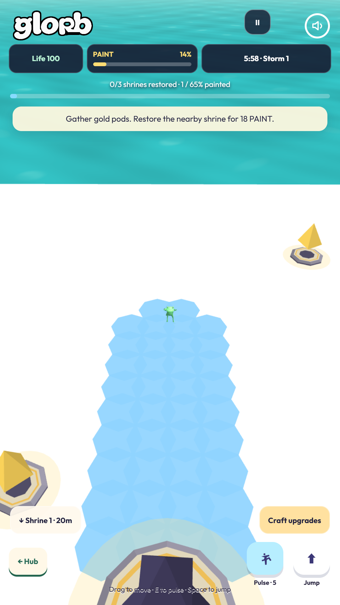
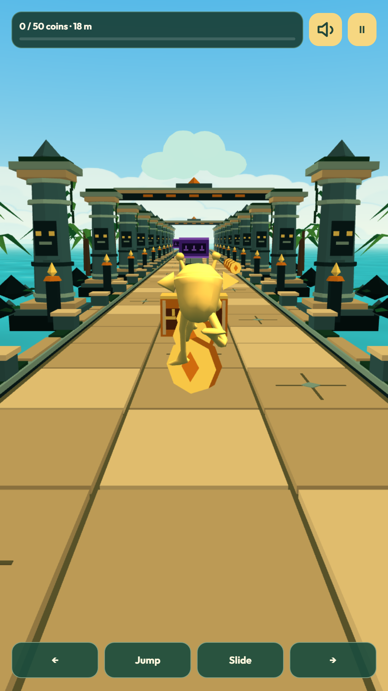
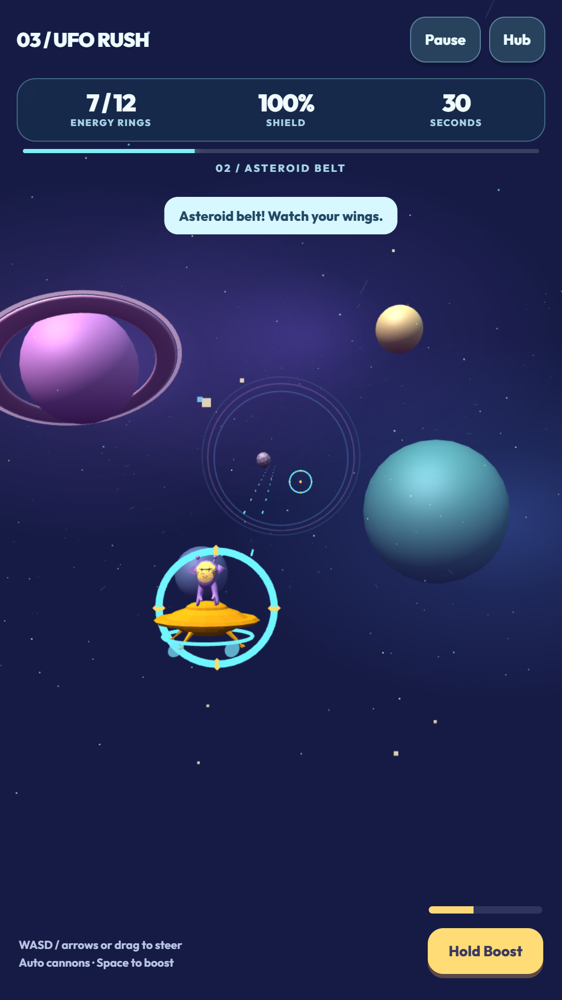
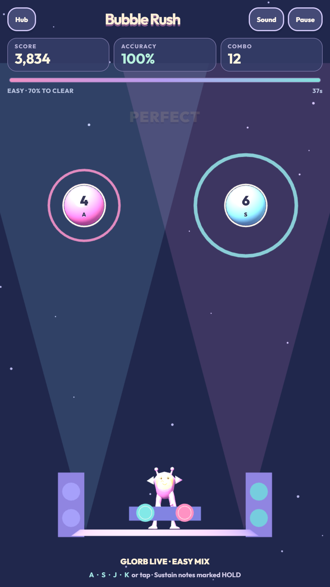
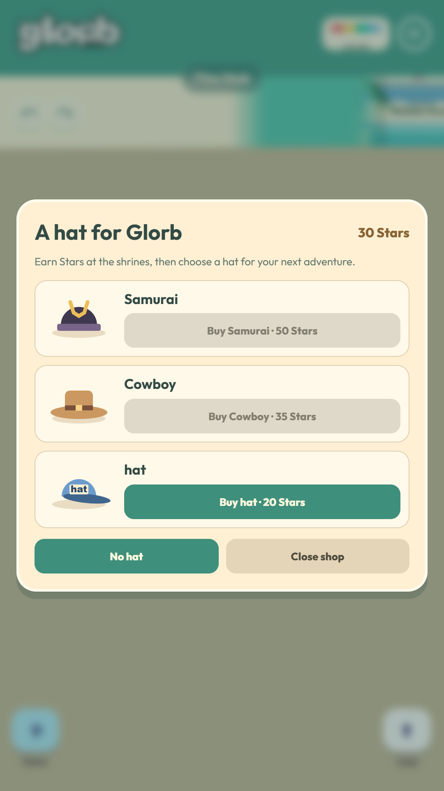
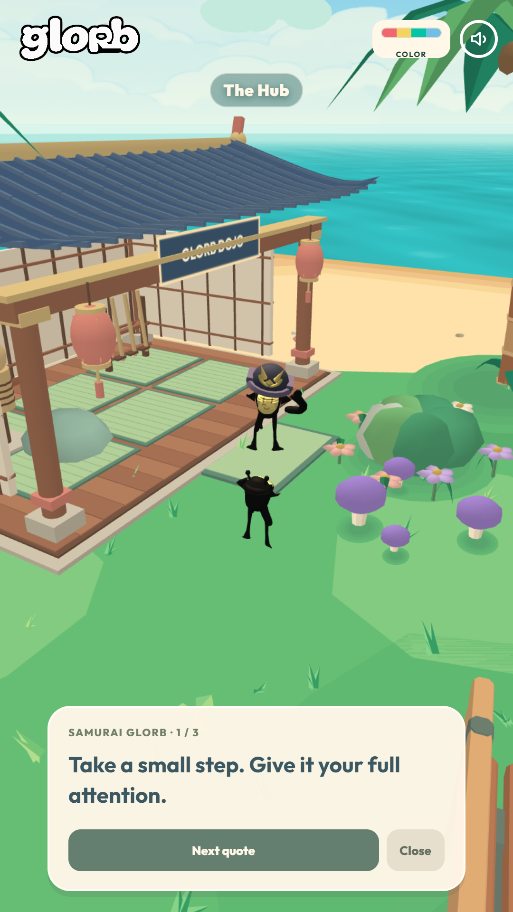

# GLORB

Your island. Your weird little adventure.

**[Play GLORB in your browser](https://vladvrx.github.io/GLORB-THE-VIDEOGAME/)**

Explore the island hub, meet its residents, collect hats, and take on the shrines. Restore colour in Island Restoration, chase coins in Temple Dash, pilot a UFO, and hit the beat in Bubble Rush. Complete the campaign milestones to unlock the Dread Warden.

Single-player. Keyboard and touch controls. Progress saves in your browser.

## The island is calling

The cover above is promotional artwork. Every gallery image below is an unedited portrait screenshot from the submission build, captured at 1080 x 1920. Click an image to see it at full size.

| Your island hub | Pick your next challenge |
| --- | --- |
|  |  |

| Bring the colour back | Run for it |
| --- | --- |
|  |  |

| Leave the island behind | Drop the beat |
| --- | --- |
|  |  |

| Find your look | Meet Samurai GLORB |
| --- | --- |
|  |  |

## Controls

Move with WASD or the arrow keys. Space jumps, Q and R rotate the camera, and E dances in the hub. Each activity shows its own controls. Touch controls appear on mobile devices.

## Download

[Download the full game ZIP](GLORB-Submission.zip). Extract it and open `Start GLORB.cmd` on Windows, or serve the extracted folder with a local HTTP server. Keep the files and folders together.

The browser version uses the same game files as the submission ZIP. The application source is included in `index.html`; runtime assets and libraries are bundled locally. See `THIRD_PARTY_NOTICES.txt` for third-party notices.
